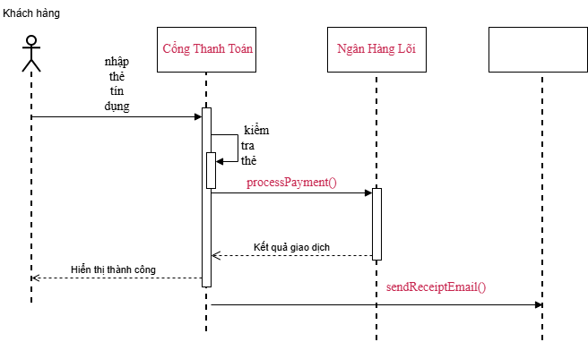

# BÁO CÁO REVIEW VÀ HIỆU CHỈNH SƠ ĐỒ TUẦN TỰ (SEQUENCE DIAGRAM)
**Dự án:** Cổng thanh toán trực tuyến RikkeiBank  
**Chức năng:** Thanh toán trực tuyến (Payment Processing Flow)  
**Người thực hiện:** Trưởng nhóm thiết kế hệ thống (Lead System Designer)  
**Đối tượng rà soát:** Bản thảo sơ đồ tuần tự của Thực tập sinh  

---

## PHẦN 1: BÁO CÁO PHÁT HIỆN LỖI VÀ PHƯƠNG ÁN HIỆU CHỈNH

Sau khi rà soát bản mô tả luồng thông điệp từ thực tập sinh, Trưởng nhóm thiết kế xác định có **02 lỗi sai nghiêm trọng** về việc lựa chọn loại thông điệp UML:

---

### Lỗi 1: Tại Bước 2 – Kiểm tra định dạng thẻ tín dụng

* **Hiện trạng thực tập sinh vẽ:** 
  Dựng thêm một Lifeline mới bên ngoài và dùng thông điệp Bất đồng bộ (**Asynchronous Message**) gửi sang đối tượng mới đó.
* **Vì sao sai & Hậu quả:** 
  Việc kiểm tra định dạng thẻ (độ dài, ký tự số, thuật toán Luhn,...) hoàn toàn là logic xử lý nội bộ của Cổng Thanh Toán. Tự ý thêm một Lifeline ngoài không có trong kiến trúc gây dư thừa tài nguyên và làm sai lệch ranh giới trách nhiệm (single responsibility). Ngoài ra, dùng **Async** khiến luồng tiếp tục chạy sang bước 3 (gửi ngân hàng lõi) trong khi chưa chắc chắn thẻ có hợp lệ hay không, dẫn đến rủi ro gửi dữ liệu rác/lỗi sang Core Banking.
* **Loại thông điệp đúng phải dùng:** 
  **Self-Message (Thông điệp Tự gọi)** – Biểu diễn bằng mũi tên vòng cung xuất phát và quay lại chính Lifeline của Cổng Thanh Toán (`validateCardFormat()`).

---

### Lỗi 2: Tại Bước 6 – Gửi email hóa đơn qua EmailServer

* **Hiện trạng thực tập sinh vẽ:** 
  Dùng thông điệp Đồng bộ (**Synchronous Message**) kèm mũi tên Return phản hồi ngay sau đó.
* **Vì sao sai & Hậu quả:** 
  Quy định nghiệp vụ nêu rõ *không được chờ EmailServer phản hồi mới hoàn tất*. Việc dùng **Sync** sẽ bắt Cổng Thanh Toán phải giữ kết nối và chờ đợi dịch vụ mail (block thread). Khi EmailServer quá tải, mạng chập chờn hoặc phản hồi chậm, toàn bộ tiến trình giao dịch bị treo, làm giảm thông lượng (throughput) của hệ thống và gây nguy cơ timeout cổng thanh toán vô lý.
* **Loại thông điệp đúng phải dùng:** 
  **Asynchronous Message (Thông điệp Bất đồng bộ)** – Biểu diễn bằng **mũi tên nét liền đầu hở (`->`)**, gửi đi rồi tiếp tục luồng công việc ngay, không đi kèm mũi tên Return.

---

## PHẦN 2: BẢNG ÁNH XẠ LUỒNG THÔNG ĐIỆP HOÀN CHỈNH (CHUẨN HÓA)

| Bước | Bên gửi (From) | Bên nhận (To) | Tên thông điệp | Loại thông điệp UML | Ký hiệu trực quan | Ghi chú nghiệp vụ |
| :---: | :--- | :--- | :--- | :--- | :--- | :--- |
| **1** | Khách hàng | Cổng Thanh Toán | `nhapTheTinDung(cardDetails)` | **Synchronous** | Mũi tên nét liền, đầu nhọn đặc | Bắt đầu giao dịch, kích hoạt activation bar |
| **2** | Cổng Thanh Toán | Cổng Thanh Toán | `validateCardFormat()` | **Self-Message** | Mũi tên vòng cung khép kín | **Đã sửa lỗi 1:** Tự kiểm tra nội bộ |
| **3** | Cổng Thanh Toán | Ngân Hàng Lõi | `processPayment(amount, cardDetails)` | **Synchronous** | Mũi tên nét liền, đầu nhọn đặc | Gửi lệnh thanh toán và chờ xử lý |
| **4** | Ngân Hàng Lõi | Cổng Thanh Toán | `ketQuaGiaoDich(Success/Fail)` | **Return** | Mũi tên nét đứt, đầu hở | Khép lại lời gọi Sync bước 3 |
| **5** | Cổng Thanh Toán | Khách hàng | `hienThiThanhCong()` | **Return** | Mũi tên nét đứt, đầu hở | Khép lại lời gọi Sync bước 1 |
| **6** | Cổng Thanh Toán | EmailServer | `sendReceiptEmail(customerInfo)` | **Asynchronous** | Mũi tên nét liền, đầu hở | **Đã sửa lỗi 2:** Fire-and-forget, không chờ |

---

## PHẦN 3: MINH HỌA SƠ ĐỒ TUẦN TỰ 

